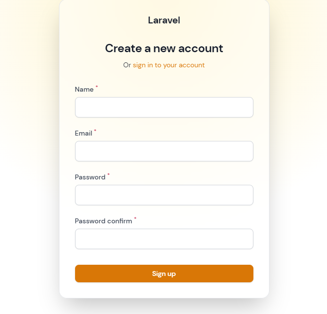

<p align="center"><a href="https://laravel.com" target="_blank"></a></p>

<h2 align="center">Sobre Projeto:</h2>

<br>

Este projeto consiste em uma API REST que implementa um sistema de gerenciamento de projetos e tarefas para usuários com diferentes níveis de acesso. Os usuários podem ser administradores (adm), gerentes (manager) ou funcionários (employee). Apenas os administradores e gerentes podem criar projetos, enquanto os funcionários podem apenas visualizá-los. Todos os usuários podem atualizar os projetos e as tarefas associadas a eles.

O objetivo deste projeto é praticar o uso do banco de dados PostgreSQL e aprender o Redis.

<br>

> ### Finalidade desse Projeto:
> O objetivo deste projeto é praticar o uso do banco de dados PostgreSQL e aprender o Redis.

<br>

## Banco de Dados:

- Utilizando PostgreSQL

## Funcionalidades Usadas:

- Autenticação com JWT
- Middlewares
- Policies - controle de acessos
- Fillament 
- Notifications - Receber notificação e email
- laravel-debugbar: monitorar a API
- Events: para limpar cache ao ter qualquer mudança no banco
- Testes Unitários e de Integração
- Sistema de Cache Utilizando Redis.

## Padrões Utilizados:
- SOLID
- Clean Code
- TDD
- Services
- Repositories

> Status do Projeto: Concluido 


## Instalar Dependencias:

```
composer install
```

Configure o Banco do PostgreSQL no .env

Esse projeto usa o redis, certifique de ter instalado.
então iniciar ele com o comando:

```
sudo service redis-server start
```

Agora rode o seed:

```
php artisan db:seed
```

e basta fazer o login com a conta:

```
Email: johndoe@example.net

Senha: 12345678
```

## Login:


## Register:


## Profile:


## Dashboard:


<br>
<br>

## Endpoints estão no repositório.

